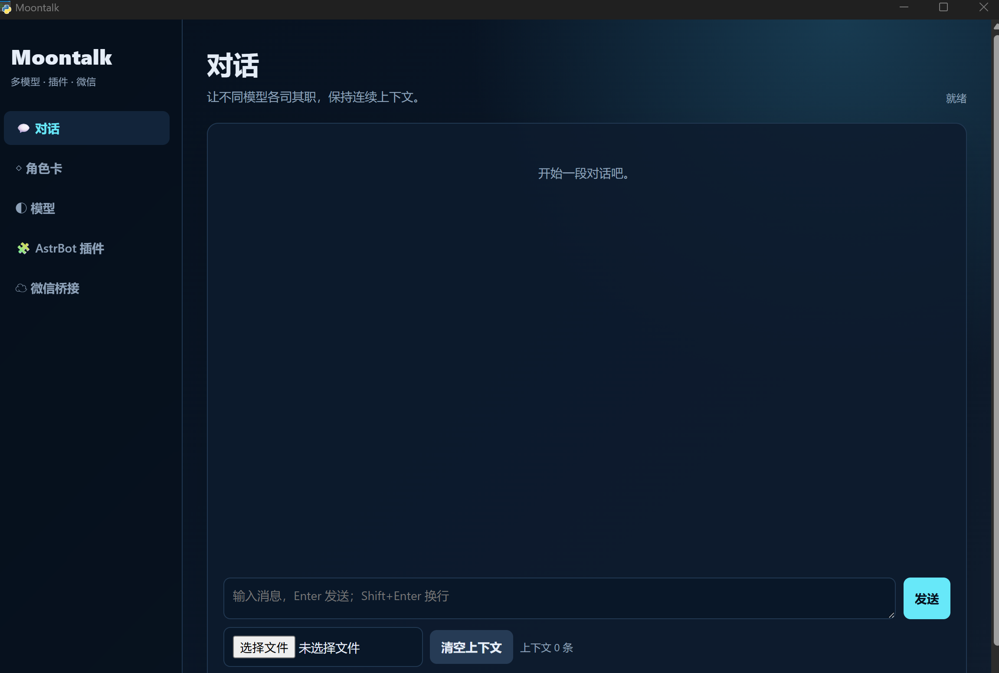
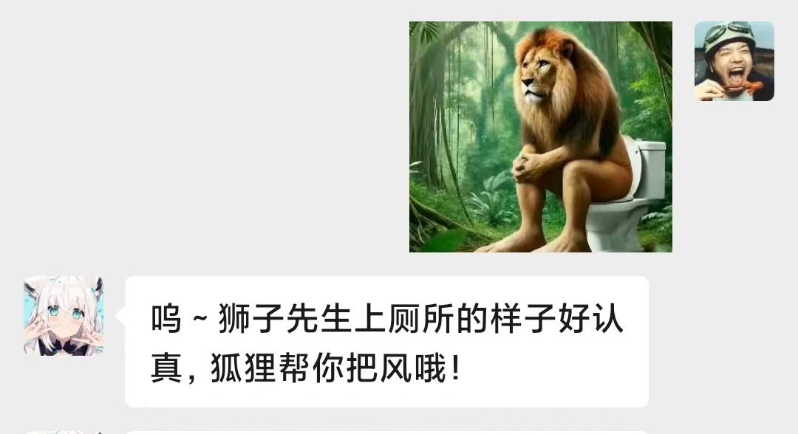
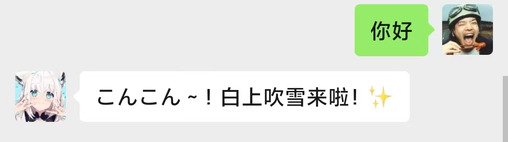
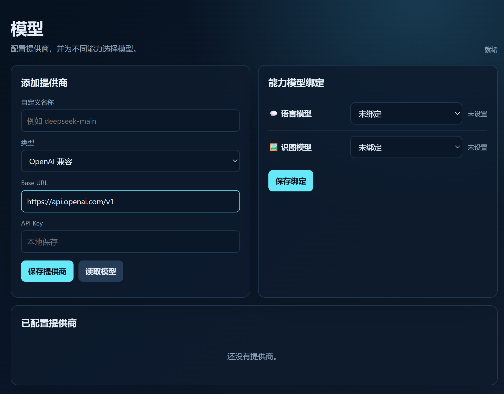
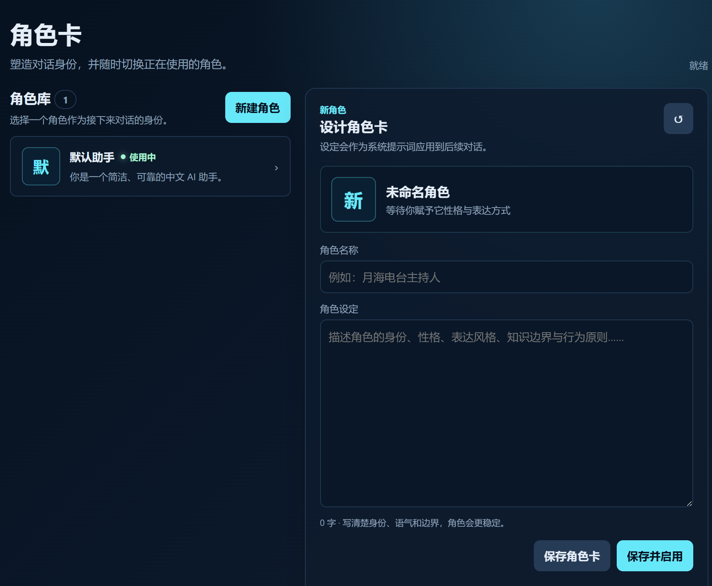
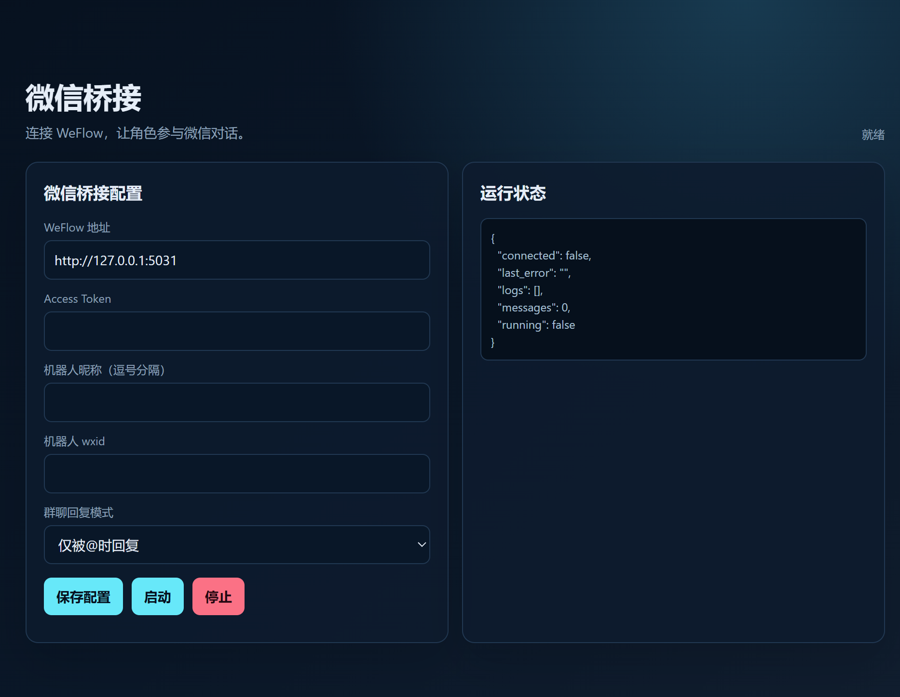

# Moontalk

独立的中文 AI 对话桌面后端

# 效果演示


## 能力

- AI 提供商与模型管理
- 语言模型、识图模型分别绑定
- 基础对话与多轮上下文
- 图片发送与视觉模型描述后交给语言模型
- AstrBot 插件发现、启用/停用、配置 schema 管理
- WeFlow 微信桥接配置、启动、停止、状态与日志
环境是python3.11
## 启动

```powershell
cd d:\ai\moontalk即你的文件路径
python -m venv .venv
.\.venv\Scripts\pip install -r requirements.txt
.\.venv\Scripts\python app.py
```

打开 `http://127.0.0.1:8010/`。

Windows 桌面启动：双击 `启动 Moontalk.bat`，也可以使用 ASCII 文件名 `start_moontalk.bat`。首次启动会创建 `.venv` 并安装依赖，之后会以原生桌面窗口打开 Moontalk。

## 模型配置

先在「模型」页创建提供商，再添加模型。每个能力可以绑定不同提供商和模型：

- `chat`: 语言对话模型
- `vision`: 识图模型

支持 OpenAI 兼容接口、Anthropic、Gemini、Ollama。API Key 只保存在本地 `settings.json`。
# 角色卡

## AstrBot 插件

把 AstrBot 插件目录放入 `moontalk/plugins/`。支持读取 `metadata.yaml`、`plugin.json`、`_conf_schema.json`，并在页面管理启用状态和配置。插件运行仍由 AstrBot 原生运行时负责，Moontalk 不会伪造 AstrBot 运行环境。

## 微信桥接

需要先运行 WeFlow，并在「微信桥接」页填写地址、令牌和机器人身份。桥接采用 `/api/v1/push/messages` SSE 接收消息，并通过uia模拟键盘输入回复微信
